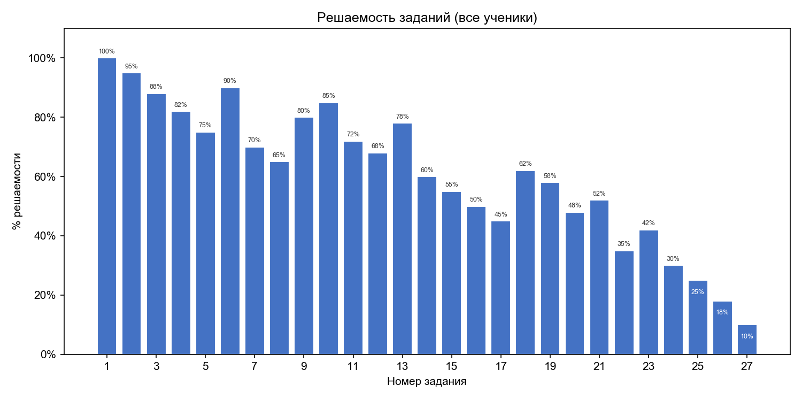
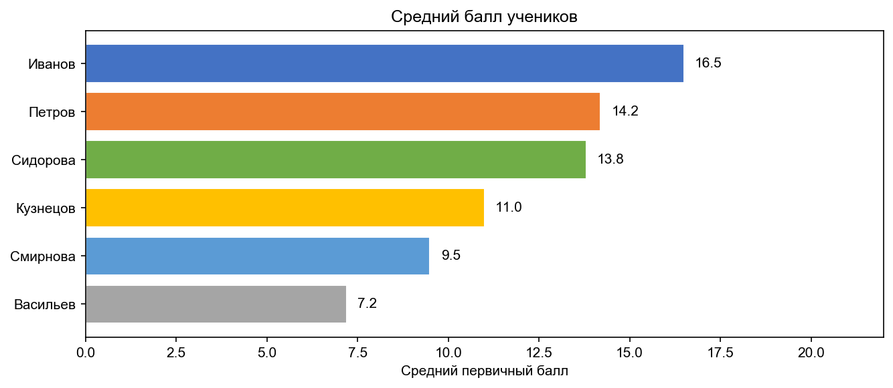
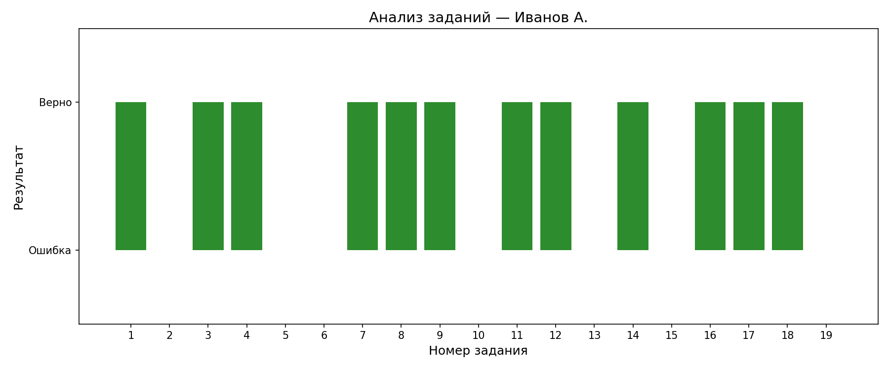

# EgeStat

Парсер и анализ результатов ЕГЭ с [kompege.ru](https://kompege.ru) через терминальное меню.

## Установка

```bash
git clone https://github.com/tuusik/EgeStat.git
cd EgeStat

python3 -m venv EgeStat_environment
source EgeStat_environment/bin/activate      # macOS / Linux
# .\EgeStat_environment\Scripts\activate     # Windows

pip install -r requirements.txt
```

## Использование

### 1. Парсинг

Скачивает JSON с результатами учеников с kompege.ru:

```bash
python3 parse_kompege.py
```

Файлы сохраняются в `files/`.

### 2. Инициализация БД

```bash
python3 init_db.py
```

Создаёт `ege_stat.db`. При повторном запуске данные не перезаписываются.

### 3. Меню

```bash
python3 menu.py
```

```
========================================
           ГЛАВНОЕ МЕНЮ
========================================
1) Показать результаты за тесты
2) Удалить тест
3) Удалить ученика
4) Переименовать ученика
5) Переименовать тест
6) Загрузить новые файлы
7) Экспорт в PDF
--- Аналитика ---
8) Статистика по заданиям
9) Средний балл учеников
10) Анализ заданий ученика
--- Графики ---
11) Построить графики
0) Выход
```

### 4. Добавление новых данных

Новые JSON положи в `files/` → выбери **6** в меню — скрипт загрузит только новые варианты.

---

## Примеры работы

### 📊 Сводная таблица (пункт 1)

Студенты × тесты. Можно показать первичные или вторичные баллы:

```
Формат отображения:
1) Первичные баллы
2) Вторичные баллы
> 1

+--------------------+------------------+-------------------+-------------------+
| Тест               | Иванов           | Петров            | Сидоров           |
+====================+==================+===================+===================+
| Вариант 1          | 15               | 12                | -                 |
+--------------------+------------------+-------------------+-------------------+
| Вариант 2          | -                | 14                | 10                |
+--------------------+------------------+-------------------+-------------------+
| Вариант 3          | 18               | -                 | 16                |
+--------------------+------------------+-------------------+-------------------+
```

### 📈 Статистика по заданиям (пункт 8)

% решаемости каждого номера задания по всем ученикам, с сортировкой:

```
Сортировать по:
1) Номеру задания
2) % решаемости (от худших к лучшим)
3) % решаемости (от лучших к худшим)
> 2

Статистика по номерам заданий (все ученики):
+--------------+----------------+
| № задания    | % решаемости   |
+==============+================+
| 27           | 12.5           |
| 26           | 25.0           |
| 24           | 37.5           |
| 23           | 62.5           |
| 1            | 87.5           |
| 2            | 100.0          |
+--------------+----------------+
```

### 📉 Средний балл учеников (пункт 9)

```
Средний балл учеников:
+----------+----------------+----------------+----------+
| Имя      | Ср. первичный  | Ср. вторичный  | Тестов   |
+==========+================+================+==========+
| Иванов   | 16.5           | 78.3           | 2        |
| Сидоров  | 13.0           | 65.0           | 2        |
| Петров   | 13.0           | 62.0           | 2        |
+----------+----------------+----------------+----------+
```

### 🔍 Анализ заданий ученика (пункт 10)

```
Выберите ученика:
1) Иванов
2) Петров
3) Сидоров
0) Отмена
> 1

Сортировать по:
1) Номеру задания
2) % решаемости (от худших к лучшим)
3) % решаемости (от лучших к худшим)
> 1

Анализ заданий для «Иванов»:
+--------------+----------------+
| № задания    | % решаемости   |
+==============+================+
| 1            | 100.0          |
| 2            | 100.0          |
| 3            | 50.0           |
| 4            | 0.0            |
+--------------+----------------+
```

### 📄 PDF-экспорт (пункт 7)

Создаёт `files/results.pdf` — сводная таблица в landscape A4, столбцы пронумерованы.

### Управление данными

```bash
python3 menu.py delete-test 1          # удалить тест с ID=1
python3 menu.py delete-student Иванов  # удалить ученика
python3 menu.py rename-student Иван Иван2   # переименовать с мержем
python3 menu.py rename-test 1 "Вариант А"   # переименовать тест
```

### 📊 Графики (пункт 11)

Подменю с тремя типами графиков, каждый открывается в отдельном окне:

```
--- ГРАФИКИ ---
1) Решаемость по заданиям (все ученики)
2) Средний балл учеников
3) Анализ заданий конкретного ученика
0) Назад
```

**Решаемость по заданиям:**



**Средний балл учеников:**



**Анализ заданий ученика:**



---

## Тесты

```bash
pytest -v
```

21 тест: схема БД, CRUD, pivot table, rename с мержем, аналитика, PDF, графики.

## Структура БД

- **variants** — варианты тестов (id, name, kim)
- **students** — ученики (id, name, баллы, variant_id)
- **results** — ответы на задания (student_id, key, score, number, task_id)
